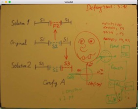
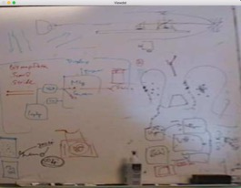

# Whiteboard it
reproduce Whiteboard it

A Whiteboard detector. Given images of Whiteboard, output Whiteboard's four corners as well as four edges. Then crop the background and leave the Whiteboard in proper position and standard scaling. We can do this in three steps. Firstly, detect edges with hough transform. Then choose the right quadrilateral. Lastly, apply a perspective transform to warp the image.

Any feedback is welcomed!

## Features
* Writing in C++ 
* Default parameters apply to diverse datasets

## Usage
### Dependencies
1. g++
2. opencv3

### Run with my datasets
Simply download this repository, compile and run. Sometimes need to change the parameter in `config.h`.

## Results
The intermediate process is shown.

### NO.1 image 
    

### NO.2 image

    

### NO.3 image 
    